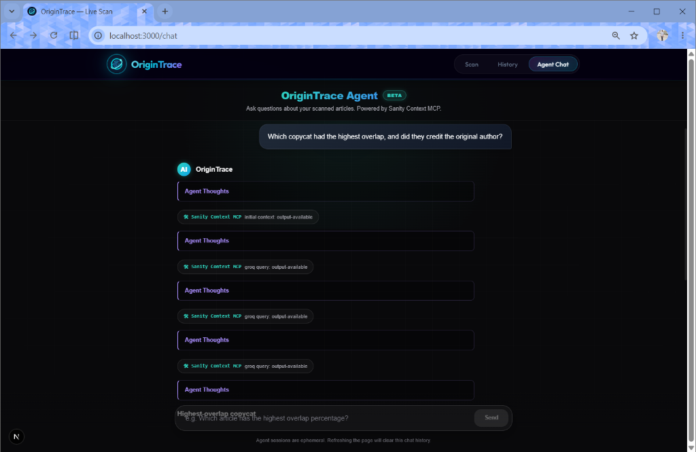
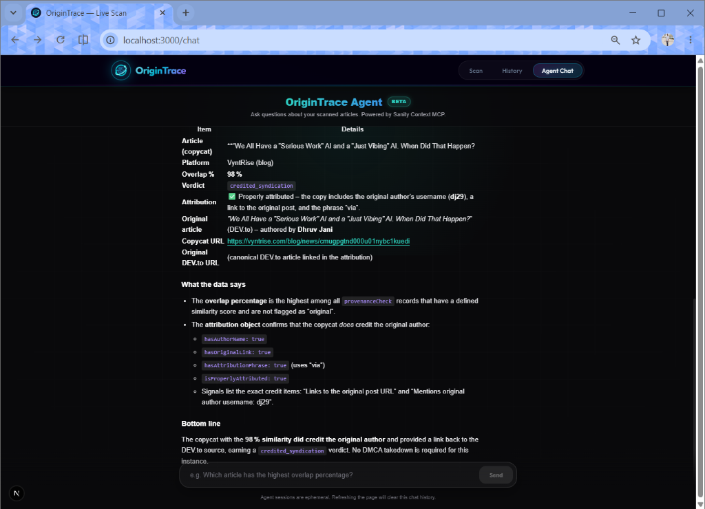
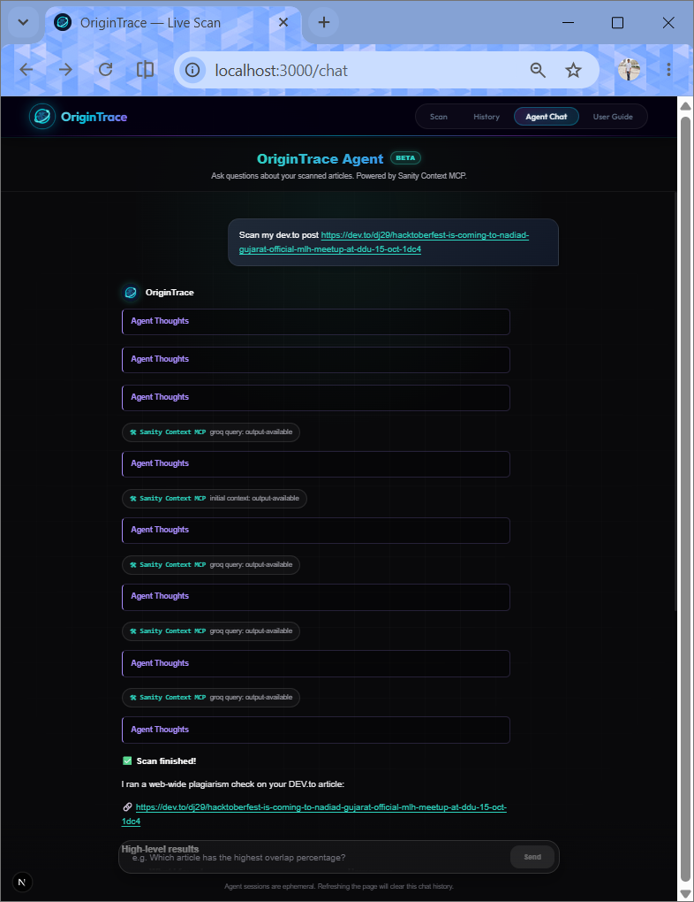
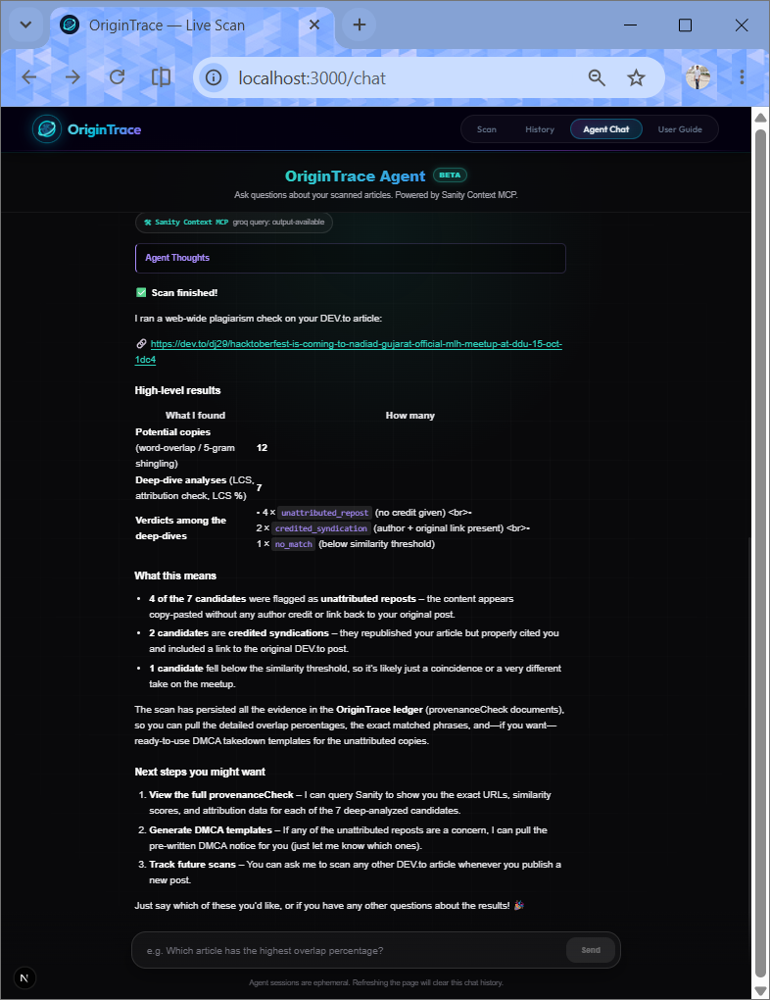

<p align="center">
  
</p>

<h1 align="center">OriginTrace</h1>

<p align="center">
  <strong>AI-Powered Content Plagiarism Detective &amp; DMCA Agent</strong><br/>
  Built for <a href="https://dev.to/challenges/sanity-2026-09-16">Path One: Ship an Agent That Queries Real Content</a> — Sanity Challenge 2026
</p>

<p align="center">
  
  
  
  
  
</p>

<p align="center">
  <a href="https://origintrace.onrender.com">Live Demo</a> ·
  <a href="https://github.com/JaniDhruv/OriginTrace">GitHub</a> ·
  <a href="#-how-it-works">How It Works</a> ·
  <a href="#-the-ai-agent">The AI Agent</a>
</p>

---

## 🧠 TL;DR

> Paste a DEV.to article URL → OriginTrace's programmatic pipeline crawls the web for stolen copies → structured evidence is persisted to the **Sanity Content Lake** → then chat with the **AI Agent** (powered by NVIDIA NIM + **Sanity Context MCP**) to analyze the data, determine attribution verdicts, generate DMCA takedown notices, and even **trigger new scans directly from the chat**.

**Why this only works with structured content:** The agent doesn't keyword-search for answers — it queries boolean attribution flags (`hasAuthorName`, `hasOriginalLink`), exact `overlapPercent` integers, and `verdict` enums from Sanity. A keyword search would never be able to answer *"Which copycat had the highest overlap but still credited the author?"* — OriginTrace can, because the content is structured.

---

## 📸 Screenshots

<p align="center">
  
  <br><em>The AI Agent dynamically querying Sanity via Context MCP, with transparent "Agent Thoughts" reasoning blocks showing its thought process in real time.</em>
</p>

<p align="center">
  
  <br><em>The Agent delivers a highly structured, actionable response — complete with markdown tables, attribution boolean breakdowns, and a clear verdict — all derived from the Sanity Knowledge Base.</em>
</p>

<p align="center">
  
  <br><em>The scanner homepage — paste any DEV.to article URL and OriginTrace's programmatic pipeline crawls the web for copies.</em>
</p>

<p align="center">
  
  <br><em>Real-time animated radar scanner showing active web crawling across multiple search engines.</em>
</p>

<p align="center">
  
  <br><em>Actionable scan report with copy counts, overlap percentages, and attribution verdicts — all persisted to Sanity.</em>
</p>

<p align="center">
  
  <br><em>Intelligent detection correctly distinguishing properly attributed cross-posts from stolen content using structured boolean evidence.</em>
</p>

<p align="center">
  
  <br><em>Sharable aggregated report pages tracking all discovered copies for a specific DEV.to article, with DMCA generation capabilities.</em>
</p>

<p align="center">
  
  <br><em>The Global Scan Ledger — a historical record of tracked DEV.to posts and their provenance status, powered by GROQ queries against the Sanity Content Lake.</em>
</p>

---

## 🎯 The Problem

Every day, developer blog posts are scraped, republished, and monetized across content farms — **without credit, without links, without permission**. Most authors never find out. The ones who do face hours of manual Googling, evidence collection, and drafting legal notices.

**OriginTrace automates the entire pipeline** — from discovery to legal action — using Sanity as the single source of truth for content provenance, and an AI Agent as the conversational interface for analyzing the evidence.

---

## ✨ Features

| Feature | Description |
|---|---|
| **💬 AI Action Agent** | Chat with an AI Agent (NVIDIA NIM via the AI SDK) that uses **Sanity Context MCP** to query your provenance data, analyze attribution booleans, draft DMCA notices, and **trigger new scans directly from chat** |
| **🔎 Web-Scale Plagiarism Detection** | Extracts distinctive phrases from your article and searches across the entire web using Serper (Google Search API) |
| **🧠 Multi-Signal Overlap Engine** | Combines word overlap (20%), 5-gram shingling (50%), and longest common subsequence / LCS (30%) for robust detection that survives reformatting |
| **⚖️ Attribution Analysis** | Checks if reposts include the original author name, a link to the original post, and attribution phrases — stored as structured booleans in Sanity |
| **📄 Instant DMCA Generator** | Auto-generates legally-structured DMCA takedown notices with evidence passages pre-filled |
| **📚 Sanity Knowledge Base** | Every article and every provenance check is persisted in Sanity's Content Lake — creating an immutable, queryable ledger |
| **📊 Aggregated Reports** | Sharable report pages that aggregate all copies found for a specific article across multiple scans |
| **🕐 Scan History Ledger** | A global ledger showing all tracked articles and their plagiarism status over time |
| **🎨 Premium Dark UI** | Glassmorphism design with animated radar scanner, staggered cards, micro-interactions, and a full-featured chatbot UI |
| **📖 Interactive User Guide** | Tabbed walkthrough of every feature with screenshots, example prompts, and blacklisted actions |

---

## 🤖 The AI Agent

This is the core of the **Path One** submission. OriginTrace's AI Agent is not a generic chatbot — it is a specialized content provenance **Action Agent** that **only works because the content is structured**.

### Action Agent: Scan From Chat

The agent doesn't just *read* data — it can **take action**. Users can ask the agent to scan a DEV.to article directly from the chat interface:

> *"Scan my dev.to post dev.to/username/my-article-slug"*

The agent triggers the full programmatic pipeline (fetch → search → compare → persist), waits for the results, and reports back with a summary of what it found — all without leaving the chat.

<p align="center">
  
  <br><em>The AI Agent triggering a live plagiarism scan directly from the chat — multiple rounds of reasoning and Sanity Context MCP queries fire automatically.</em>
</p>

<p align="center">
  
  <br><em>After the scan completes, the agent reports a structured summary — 12 potential copies found, 4 unattributed reposts, 2 credited syndications — with next steps for the user.</em>
</p>

### Blacklisted Prompts

The agent enforces strict guardrails to stay focused and prevent abuse:

| Blacklisted Action | Reason |
|---|---|
| "Scan all my posts" | Server timeout risk — one URL at a time only |
| "Scan my Medium article" | Pipeline is DEV.to-exclusive |
| "Write a React component" | Off-topic — agent stays in character |
| "Delete this article" | Agent has read-only Sanity access |
| Fake DMCA drafts | Refuses to draft takedowns against URLs not in Sanity as `unattributed_repost` |

### How It Works

```
User asks: "Which copycat had the highest overlap but still credited me?"
                            │
                            ▼
              ┌──────────────────────────┐
              │   AI Agent (NVIDIA NIM)  │
              │   nvidia/nemotron-3.5-   │
              │   lightning-30b-a3b      │
              └────────────┬─────────────┘
                           │
                    Calls MCP tools
                           │
                           ▼
              ┌──────────────────────────┐
              │  Sanity Context MCP      │
              │  - initial_context       │
              │  - groq_query            │
              └────────────┬─────────────┘
                           │
                 Executes GROQ queries
                           │
                           ▼
              ┌──────────────────────────┐
              │  Sanity Content Lake     │
              │  - article documents     │
              │  - provenanceCheck docs  │
              │  - author references     │
              └────────────┬─────────────┘
                           │
              Returns structured JSON
                           │
                           ▼
              ┌──────────────────────────┐
              │  Agent interprets:       │
              │  • overlapPercent: 98    │
              │  • hasAuthorName: true   │
              │  • hasOriginalLink: true │
              │  • verdict: credited_    │
              │    syndication           │
              │                          │
              │  → "No DMCA needed."     │
              └──────────────────────────┘
```

### Why This Needs Structured Content

The agent queries **typed fields** in Sanity, not free text:

| Field | Type | What The Agent Does With It |
|---|---|---|
| `overlapPercent` | `number` | Ranks copycats by similarity — "which has the highest?" |
| `verdict` | `string` (enum) | Filters by `unattributed_repost` vs `credited_syndication` |
| `attribution.hasAuthorName` | `boolean` | Determines if the copy credits the author |
| `attribution.hasOriginalLink` | `boolean` | Determines if the copy links back |
| `attribution.isProperlyAttributed` | `boolean` | Combined verdict on proper attribution |
| `attribution.signals` | `string[]` | Lists what credit was found (e.g., "Links to original post URL") |
| `attribution.missing` | `string[]` | Lists what credit is missing (e.g., "No author name") |
| `dmcaTemplate` | `text` | Pre-generated DMCA template the agent can retrieve and customize |

A keyword search would never answer *"Show me all copies above 80% overlap that are missing the author name but have the original link."* OriginTrace can, because every signal is a queryable field in Sanity.

### Tech Stack (Agent)

| Component | Technology |
|---|---|
| **AI Framework** | [AI SDK](https://sdk.vercel.ai/) (`ai` + `@ai-sdk/react` + `@ai-sdk/mcp`) |
| **LLM** | NVIDIA NIM (`nvidia/nemotron-3.5-lightning-30b-a3b`) |
| **MCP Bridge** | Sanity Context MCP (`@ai-sdk/mcp` with HTTP transport) |
| **Knowledge Base** | Sanity Content Lake (GROQ-queryable structured documents) |
| **Streaming** | Server-sent events via `streamText()` with reasoning support |

---

## 🔬 How Sanity Powers Everything

Sanity isn't just a database here — it's the **knowledge base** that the agent actively reconciles against.

### 1. Indexing (Write Path)
When a user scans a DEV.to URL, the programmatic pipeline fetches the article, extracts its content, and persists it as a canonical `article` document in Sanity. This establishes the provenance claim.

### 2. Reconciliation (Compare Path)
When candidates are found on the web, the pipeline fetches the canonical article from Sanity and runs multi-signal overlap analysis (word overlap, 5-gram shingling, LCS) against the candidate. The Sanity document is the ground truth.

### 3. Evidence Persistence (Write-Back Path)
Every provenance check — verdict, overlap percentage, attribution evidence, matched passages, DMCA template — is stored back in Sanity as a `provenanceCheck` document linked to the original article. This creates an auditable chain of evidence.

### 4. Agent Queries (Read Path via MCP)
The AI Agent connects to Sanity Context MCP and dynamically writes GROQ queries at runtime to answer user questions. It reads the structured fields, interprets boolean flags, ranks results by overlap percentage, and generates legal templates — all grounded in the Content Lake.

### 5. Pre-Fetched Structured Context
Before the agent starts reasoning, the backend runs `fetchSanityContext()` — a dedicated function that executes GROQ queries directly against Sanity to build a structured snapshot of all indexed articles and their provenance checks (per-article breakdowns, attribution booleans, overlap percentages, aggregate platform stats). This snapshot is injected into the agent's system prompt, giving it instant answers for summary questions without an MCP round-trip.

### Sanity Schema Design

```
┌──────────┐       ┌───────────┐       ┌──────────────────┐
│  author  │◄──────│  article  │◄──────│ provenanceCheck  │
│          │  ref  │           │  ref  │                  │
│ • name   │       │ • title   │       │ • checkedUrl     │
│ • handle │       │ • body    │       │ • verdict        │
│ • bio    │       │ • slug    │       │ • overlapPercent │
│          │       │ • canon.  │       │ • attribution {} │
│          │       │ • publish │       │   .hasAuthorName │
│          │       │ • platform│       │   .hasOrigLink   │
│          │       │           │       │   .signals[]     │
│          │       │           │       │   .missing[]     │
│          │       │           │       │ • dmcaTemplate   │
│          │       │           │       │ • reconciledEntr.│
└──────────┘       └───┬───────┘       └──────────────────┘
                       │ ref
                  ┌────▼─────┐
                  │   user   │
                  │          │
                  │ • name   │
                  │ • email  │
                  │ • authId │
                  │ • avatar │
                  └──────────┘
```

**Sanity Project ID**: `iossngh3`

---

## 🧩 Full Pipeline

```
┌─────────────────────────────────────────────────────────────┐
│                    USER PASTES DEV.TO URL                    │
└──────────────────────────┬──────────────────────────────────┘
                           │
                           ▼
              ┌────────────────────────┐
              │  1. FETCH & EXTRACT    │
              │  Mozilla Readability   │
              │  + Cheerio parsing     │
              └───────────┬────────────┘
                          │
                          ▼
              ┌────────────────────────┐
              │  2. PERSIST TO SANITY  │
              │  article + author      │
              │  (canonical source)    │
              └───────────┬────────────┘
                          │
                          ▼
              ┌────────────────────────┐
              │  3. PHRASE EXTRACTION  │
              │  Title + 4 distinctive │
              │  sentences from body   │
              └───────────┬────────────┘
                          │
                          ▼
              ┌────────────────────────┐
              │  4. WEB SEARCH         │
              │  Serper.dev quoted     │
              │  phrase queries        │
              └───────────┬────────────┘
                          │
                          ▼
              ┌────────────────────────┐
              │  5. CANDIDATE SCRAPING │
              │  Fetch up to 15 pages  │
              │  Extract + clean text  │
              └───────────┬────────────┘
                          │
                          ▼
         ┌────────────────────────────────────┐
         │  6. SANITY-BACKED RECONCILIATION   │
         │                                    │
         │  Word Overlap (20%) ──┐            │
         │  5-gram Shingles (50%)├─▶ Score    │
         │  LCS Ratio (30%) ─────┘            │
         │                                    │
         │  + Attribution Analysis            │
         │  + Passage Matching                │
         └─────────────────┬──────────────────┘
                           │
                           ▼
              ┌────────────────────────┐
              │  7. VERDICT & PERSIST  │
              │  → credited_syndication│
              │  → unattributed_repost │
              │  → no_match            │
              │                        │
              │  + DMCA template gen   │
              │  + Store in Sanity     │
              └────────────────────────┘
                           │
                           ▼
              ┌────────────────────────┐
              │  8. AI AGENT ANALYSIS  │
              │  Chat with the agent   │
              │  via Sanity Context    │
              │  MCP to query, analyze │
              │  and act on results    │
              └────────────────────────┘
```

### The Three Verdicts

| Verdict | Meaning | Action |
|---|---|---|
| ✅ `credited_syndication` | Repost includes author name **and** original link | No action needed |
| 🔴 `unattributed_repost` | Content duplicated without proper credit | DMCA template generated |
| ⬚ `no_match` | Below similarity threshold | Filtered out |

---

## 🏗 Architecture

### Full Tech Stack

| Layer | Technology | Purpose |
|---|---|---|
| **Frontend** | Next.js 16 (App Router) | SSR pages, client-side scanner UI, chat interface |
| **Styling** | Vanilla CSS | Glassmorphism, animations, dark theme |
| **Typography** | Google Fonts (Outfit + JetBrains Mono) | Premium sans-serif + monospace |
| **Knowledge Base** | Sanity Content Lake | Immutable ledger for articles + provenance checks |
| **AI Agent LLM** | NVIDIA NIM (Nemotron 3.5) | Reasoning and response generation |
| **Agent Framework** | AI SDK (`ai`, `@ai-sdk/react`, `@ai-sdk/mcp`) | Streaming chat, tool-use, MCP integration |
| **MCP Bridge** | Sanity Context MCP | Connects the agent to the Sanity Knowledge Base |
| **Web Search** | Serper.dev (Google Search API) | Discovering potential copies across the web |
| **Content Extraction** | Mozilla Readability + Cheerio + JSDOM | Cleaning and parsing web pages |
| **Overlap Detection** | Custom NLP engine (TypeScript) | Word overlap, n-gram shingling, LCS |
| **DMCA Generation** | Template engine | Legal-ready takedown notices |
| **Deployment** | Render | Production hosting |

### Agent Modules

| Module | File | Responsibility |
|---|---|---|
| **Fetcher** | `agent/fetcher.ts` | Fetches URLs, extracts clean text via Readability, parses metadata |
| **Search** | `agent/search.ts` | Extracts distinctive phrases, queries Serper with quoted-phrase searches |
| **Verdict** | `agent/verdict.ts` | Core reconciliation engine — tokenization, word overlap, 5-gram shingling, LCS ratio, attribution analysis |
| **DMCA** | `agent/dmca.ts` | Generates legally-structured DMCA takedown templates with evidence |
| **MCP Client** | `agent/mcp-client.ts` | Direct Sanity Context MCP client (`initial_context`, `groq_query`) |

### API Routes

| Endpoint | Method | Purpose |
|---|---|---|
| `/api/chat` | POST | AI Action Agent — streams responses via Sanity Context MCP + custom `scan_article` tool |
| `/api/scan` | POST | Full scan pipeline — fetch, search, compare, persist |
| `/api/report/[articleId]` | GET | Aggregated report data for a specific article |
| `/api/stats` | GET | Global platform statistics (deduplicated) |
| `/api/check/[id]` | GET | Individual provenance check detail |
| `/api/articles` | GET | List all indexed articles from Sanity |
| `/api/checks` | GET | List recent provenance checks |

### Pages

| Route | Description |
|---|---|
| `/` | Live scanner — paste a DEV.to URL, watch the radar animation, see results |
| `/chat` | **AI Action Agent** — conversational interface to query Sanity data and trigger scans |
| `/history` | Scan Ledger — all tracked articles grouped by post, with copy counts |
| `/guide` | **User Guide** — tabbed walkthrough with screenshots, prompts, and blacklisted actions |
| `/report/[articleId]` | Sharable aggregated report — all copies for a specific article |
| `/check/[id]` | Individual check detail — full DMCA template, attribution evidence |
| `/studio` | Embedded Sanity Studio — manage documents, schemas, and the Content Lake directly |

---

## 🚀 Quick Start

### Prerequisites

- **Node.js 18+**
- **Sanity account** — [sanity.io](https://www.sanity.io)
- **Serper.dev API key** — [serper.dev](https://serper.dev) (free tier: 2,500 searches)
- **NVIDIA NIM API key** — [build.nvidia.com](https://build.nvidia.com) (free inference credits)

### Setup

```bash
# Clone the repo
git clone https://github.com/JaniDhruv/OriginTrace.git
cd OriginTrace

# Install dependencies
npm install

# Configure environment
cp .env.example .env.local
# Fill in your credentials (see table below)

# Run the dev server
npm run dev
```

Open [http://localhost:3000](http://localhost:3000) to scan articles, and [http://localhost:3000/chat](http://localhost:3000/chat) to chat with the AI Agent.

### Optional: Seed Your DEV.to Portfolio

```bash
DEVTO_HANDLE=yourhandle npm run seed
```

This fetches all your published DEV.to articles and indexes them in Sanity as canonical sources.

---

## 🔐 Environment Variables

| Variable | Required | Description |
|---|---|---|
| `NEXT_PUBLIC_SANITY_PROJECT_ID` | ✅ | Your Sanity project ID |
| `NEXT_PUBLIC_SANITY_DATASET` | ✅ | Dataset name (default: `production`) |
| `SANITY_API_TOKEN` | ✅ | Sanity API token with **write** access |
| `SANITY_API_READ_TOKEN` | ✅ | Sanity API token with **read** access (for MCP auth) |
| `SERPER_API_KEY` | ✅ | Serper.dev API key for web search |
| `NIM_API_KEY` | ✅ | NVIDIA NIM API key for the AI Agent |
| `SANITY_ORG_ID` | ❌ | Sanity org ID (for Context MCP endpoint) |
| `SANITY_CONTEXT_API_TOKEN` | ❌ | Org-level token for Context MCP |
| `SANITY_MCP_ENDPOINT` | ❌ | Custom Sanity Context MCP endpoint URL |
| `NIM_MODEL` | ❌ | Override model ID (default: `nvidia/nemotron-3.5-lightning-30b-a3b`) |
| `DEVTO_HANDLE` | ❌ | DEV.to username for portfolio seeding |

---

## 🎨 Design Philosophy

OriginTrace uses a **dark-mode glassmorphism** design language with neon accent colors:

- **Background**: Multi-layer radial gradients with subtle ambient glows and pulse animations
- **Cards**: Frosted glass panels with `backdrop-filter: blur()` and luminous borders
- **Typography**: [Outfit](https://fonts.google.com/specimen/Outfit) (headings) + [JetBrains Mono](https://fonts.google.com/specimen/JetBrains+Mono) (data/code)
- **Scanner Animation**: Concentric radar circles with a rotating sweep arm — plays during live scans
- **Chat UI**: Slide-up message animations, gradient-glow avatar, collapsible reasoning blocks, floating input bar
- **Color System**: Neon cyan (`#2dd4bf`) for safe/credited, red (`#ef4444`) for actionable takedowns, purple (`#a78bfa`) for agent reasoning

---

## 📁 Project Structure

```
OriginTrace/
├── agent/                    # Programmatic pipeline modules
│   ├── fetcher.ts            #   Web page fetching + content extraction
│   ├── search.ts             #   Serper-powered web search + phrase extraction
│   ├── verdict.ts            #   Multi-signal overlap engine + attribution analysis
│   ├── dmca.ts               #   DMCA takedown template generator
│   └── mcp-client.ts         #   Direct Sanity Context MCP client
│
├── app/                      # Next.js App Router
│   ├── page.tsx              #   Homepage — live scanner UI
│   ├── layout.tsx            #   Root layout + sticky navbar
│   ├── globals.css           #   Complete design system (hand-crafted CSS)
│   ├── chat/
│   │   ├── page.tsx          #   AI Action Agent chat interface
│   │   └── chat.module.css   #   Premium chatbot styles
│   ├── guide/
│   │   ├── page.tsx          #   Interactive User Guide (tabbed)
│   │   └── guide.module.css  #   Guide page styles
│   ├── history/page.tsx      #   Scan Ledger — articles grouped by post
│   ├── report/[articleId]/   #   Sharable aggregated report page
│   ├── check/[id]/           #   Individual provenance check detail
│   └── api/
│       ├── chat/route.ts     #   POST — AI Agent (NIM + Sanity Context MCP)
│       ├── scan/route.ts     #   POST — full scan pipeline
│       ├── report/[id]/      #   GET — aggregated report data
│       ├── stats/route.ts    #   GET — global stats (deduplicated)
│       └── check/[id]/       #   GET — individual check data
│
├── sanity/
│   ├── client.ts             # Sanity read/write client configuration
│   └── schemas/
│       ├── article.ts        #   Canonical article document
│       ├── author.ts         #   Author profile document
│       ├── provenanceCheck.ts #  Provenance check record (the core schema)
│       └── user.ts           #   User account document (future auth)
│
├── scripts/
│   └── seed.ts               # DEV.to portfolio seeder
│
└── package.json
```

---

## 🔮 Future Enhancements

| Enhancement | Description |
|---|---|
| **🌐 Multi-Platform Support** | Extend beyond DEV.to — support Hashnode, Medium, personal blogs |
| **🔐 User Authentication** | Add NextAuth/JWT login so each author has their own dashboard |
| **📬 Automated Monitoring** | Cron-based re-scanning — get alerts when new copies appear |
| **🤖 Paraphrase Detection** | Use LLMs to detect rewritten content that evades word-overlap detection |
| **📊 Analytics Dashboard** | Visualize plagiarism trends over time — charts, top offending domains |
| **🔗 Direct DMCA Filing** | Integrate with Google's DMCA form for one-click takedown submissions |
| **🧩 Browser Extension** | Chrome/Firefox extension to scan any page you're reading |

> **Note**: Authentication is intentionally omitted for demo purposes. The current design showcases a global public ledger where all scans are visible — similar to a blockchain explorer for content provenance. In production, JWT/NextAuth would gate the features per-user.

---

## 🤝 Contributing

Contributions are welcome! If you'd like to add multi-platform support, paraphrase detection, or improve the NLP engine, please:

1. Fork the repository
2. Create a feature branch (`git checkout -b feature/amazing-feature`)
3. Commit your changes (`git commit -m 'Add amazing feature'`)
4. Push to the branch (`git push origin feature/amazing-feature`)
5. Open a Pull Request

---

## 📜 License

MIT — see [LICENSE](LICENSE).

---

<p align="center">
  Built with ☕ and righteous fury for the <a href="https://dev.to/challenges/sanity-2026-09-16">Sanity AI Challenge 2026</a>
</p>
