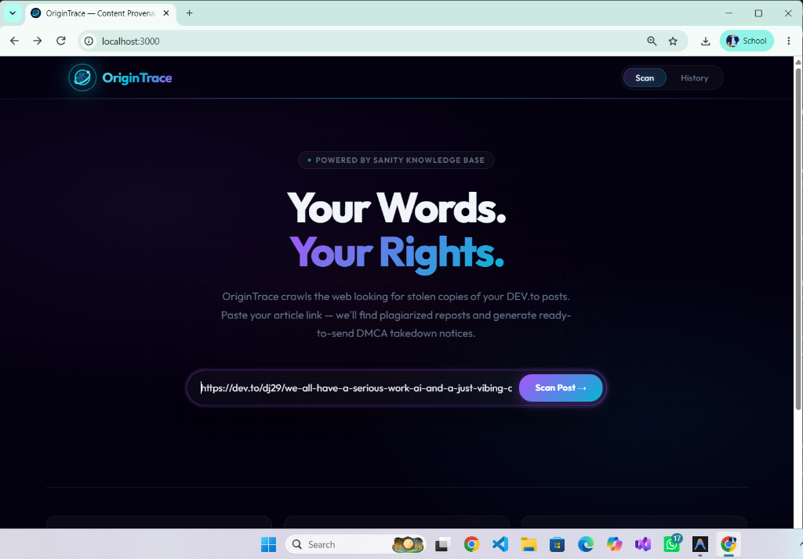
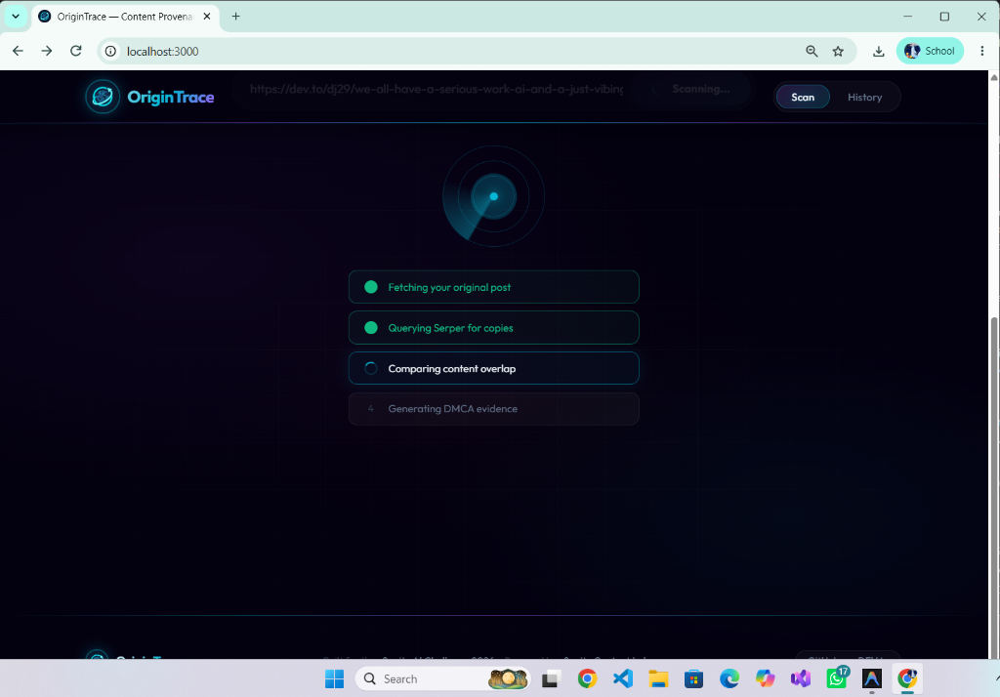
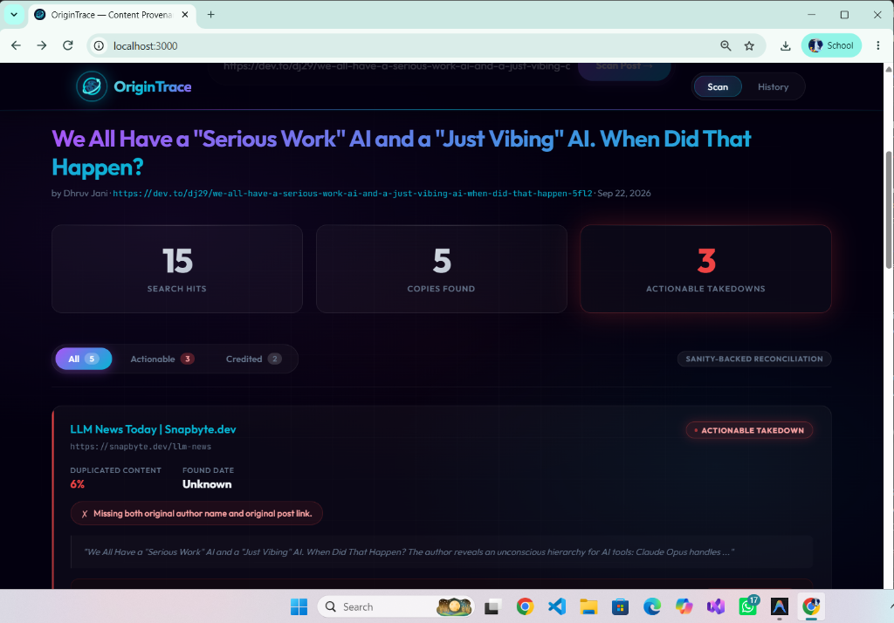
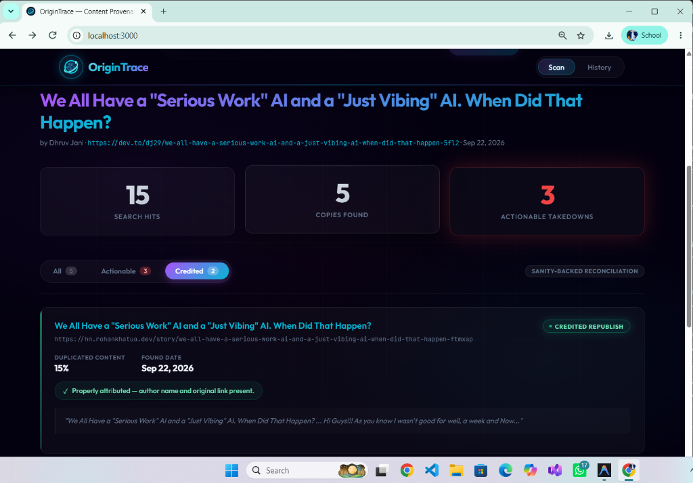
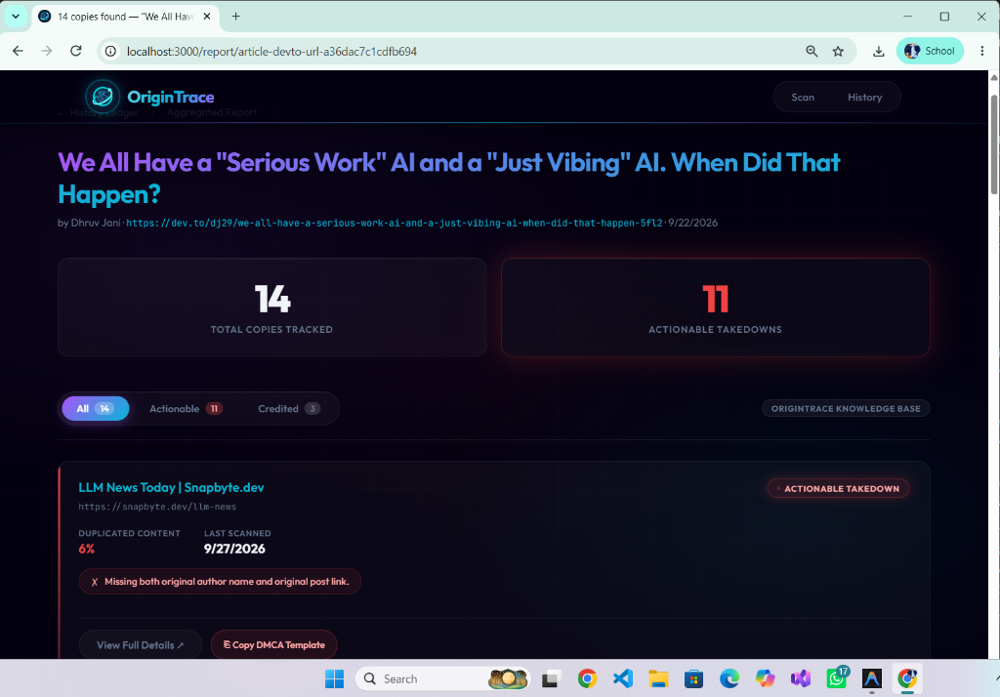
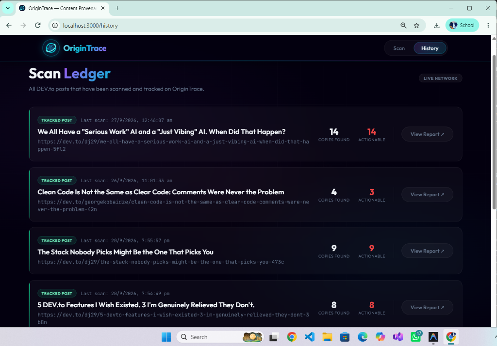

<p align="center">
  
  
  
  
</p>

<p align="center">
  
</p>

<h1 align="center">OriginTrace</h1>

<p align="center">
  <strong>An AI-powered content provenance agent that protects your intellectual property.</strong><br/>
  Paste a DEV.to article → OriginTrace crawls the web for stolen copies → generates DMCA takedowns — all backed by Sanity's Content Lake as the immutable knowledge base.
</p>

<p align="center">
  <a href="https://github.com/JaniDhruv/OriginTrace">GitHub</a> ·
  <a href="#-how-it-works">How It Works</a> ·
  <a href="#-architecture">Architecture</a> ·
  <a href="#-quick-start">Quick Start</a>
</p>

---

## 📸 Screenshots

<p align="center">
  
  <br><em>Premium glassmorphism hero interface for initiating a content provenance scan.</em>
</p>

<p align="center">
  
  <br><em>Real-time animated radar scanner showing the active AI agents executing the provenance check.</em>
</p>

<p align="center">
  
  <br><em>Actionable scan report detailing total copies found, attribution status, and missing evidence.</em>
</p>

<p align="center">
  
  <br><em>Intelligent detection correctly identifying properly attributed cross-posts versus stolen content.</em>
</p>

<p align="center">
  
  <br><em>Sharable aggregated report pages tracking all discovered copies for a specific DEV.to article, complete with DMCA generation capabilities.</em>
</p>

<p align="center">
  
  <br><em>The Global Scan Ledger powered by Sanity, showing a historical record of tracked DEV.to posts.</em>
</p>

---

## 🎯 The Problem

Every day, developer blog posts are scraped, republished, and monetized across content farms — **without credit, without links, without permission**. Most authors never find out. The ones who do face hours of manual Googling, evidence collection, and drafting DMCA notices.

**OriginTrace automates the entire pipeline** — from discovery to legal action — using Sanity as the single source of truth for content provenance.

---

## ✨ Features

| Feature | Description |
|---|---|
| **🔎 Web-Scale Plagiarism Detection** | Extracts distinctive phrases from your article and searches across the entire web using Serper (Google Search API) |
| **🧠 Multi-Signal Overlap Engine** | Combines word overlap, 5-gram shingling, and longest common subsequence (LCS) for robust detection that survives reformatting |
| **⚖️ Attribution Analysis** | Checks if reposts include the original author name, a link to the original post, and attribution phrases |
| **📄 Instant DMCA Generator** | Auto-generates legally-structured DMCA takedown notices with evidence passages pre-filled |
| **📚 Sanity Knowledge Base** | Every article and every provenance check is persisted in Sanity's Content Lake — creating an immutable, queryable ledger |
| **📊 Aggregated Reports** | Sharable report pages that aggregate all copies found for a specific article across multiple scans |
| **🕐 Scan History Ledger** | A global ledger showing all tracked articles and their plagiarism status over time |
| **🎨 Premium Dark UI** | Glassmorphism design with animated radar scanner, staggered cards, and micro-interactions |

---

## 🧩 How It Works

```
┌─────────────────────────────────────────────────────────────┐
│                    USER PASTES DEV.TO URL                    │
└──────────────────────────┬──────────────────────────────────┘
                           │
                           ▼
              ┌────────────────────────┐
              │  1. FETCH & EXTRACT    │
              │  Mozilla Readability   │
              │  + Cheerio parsing     │
              └───────────┬────────────┘
                          │
                          ▼
              ┌────────────────────────┐
              │  2. PERSIST TO SANITY  │
              │  article + author      │
              │  (canonical source)    │
              └───────────┬────────────┘
                          │
                          ▼
              ┌────────────────────────┐
              │  3. PHRASE EXTRACTION  │
              │  Title + 4 distinctive │
              │  sentences from body   │
              └───────────┬────────────┘
                          │
                          ▼
              ┌────────────────────────┐
              │  4. WEB SEARCH         │
              │  Serper.dev quoted     │
              │  phrase queries        │
              └───────────┬────────────┘
                          │
                          ▼
              ┌────────────────────────┐
              │  5. CANDIDATE SCRAPING │
              │  Fetch up to 20 pages  │
              │  Extract + clean text  │
              └───────────┬────────────┘
                          │
                          ▼
         ┌────────────────────────────────────┐
         │  6. SANITY-BACKED RECONCILIATION   │
         │                                    │
         │  Word Overlap (20%) ──┐            │
         │  5-gram Shingles (50%)├─▶ Score    │
         │  LCS Ratio (30%) ─────┘            │
         │                                    │
         │  + Attribution Analysis            │
         │  + Passage Matching                │
         └─────────────────┬──────────────────┘
                           │
                           ▼
              ┌────────────────────────┐
              │  7. VERDICT & PERSIST  │
              │  → credited_syndication│
              │  → unattributed_repost │
              │  → no_match            │
              │                        │
              │  + DMCA template gen   │
              │  + Store in Sanity     │
              └────────────────────────┘
```

### The Three Verdicts

| Verdict | Meaning | Action |
|---|---|---|
| ✅ `credited_syndication` | Repost includes author name **and** original link | No action needed |
| 🔴 `unattributed_repost` | Content duplicated without proper credit | DMCA template generated |
| ⬚ `no_match` | Below similarity threshold | Filtered out |

---

## 🏗 Architecture

### Tech Stack

| Layer | Technology | Purpose |
|---|---|---|
| **Frontend** | Next.js 16 (App Router) | SSR pages, client-side scanner UI |
| **Styling** | Vanilla CSS | Glassmorphism, animations, dark theme |
| **Typography** | Google Fonts (Outfit + JetBrains Mono) | Premium sans-serif + monospace |
| **Knowledge Base** | Sanity Content Lake | Immutable ledger for articles + provenance checks |
| **Web Search** | Serper.dev (Google Search API) | Discovering potential copies across the web |
| **Content Extraction** | Mozilla Readability + Cheerio + JSDOM | Cleaning and parsing web pages |
| **Overlap Detection** | Custom NLP engine (TypeScript) | Word overlap, n-gram shingling, LCS |
| **DMCA Generation** | Template engine | Legal-ready takedown notices |

### Sanity Schema Design

```
┌──────────┐       ┌───────────┐       ┌──────────────────┐
│  author  │◄──────│  article  │◄──────│ provenanceCheck  │
│          │  ref  │           │  ref  │                  │
│ • name   │       │ • title   │       │ • checkedUrl     │
│ • handle │       │ • body    │       │ • verdict        │
│ • bio    │       │ • slug    │       │ • overlapPercent │
│          │       │ • canon.  │       │ • attribution    │
│          │       │ • publish │       │ • dmcaTemplate   │
│          │       │ • platform│       │ • reconciledEntr.│
└──────────┘       └───────────┘       └──────────────────┘
```

**Why Sanity?** Sanity acts as the **single source of truth** — the "knowledge base" that the agent reconciles against. When OriginTrace finds a candidate copy, it doesn't just compare strings — it queries the canonical article stored in Sanity, runs multi-signal overlap analysis, and persists the provenance check back into the Content Lake. This creates an auditable, queryable history of every plagiarism check ever run.

### Agent Modules

| Module | File | Responsibility |
|---|---|---|
| **Fetcher** | `agent/fetcher.ts` | Fetches URLs, extracts clean text via Readability, parses metadata (dates, authors, outbound links) from raw HTML |
| **Search** | `agent/search.ts` | Extracts distinctive phrases from article body, queries Serper with quoted-phrase searches, deduplicates by URL |
| **Verdict** | `agent/verdict.ts` | Core reconciliation engine — tokenization, word overlap, 5-gram shingling, LCS ratio, attribution analysis |
| **DMCA** | `agent/dmca.ts` | Generates legally-structured DMCA takedown templates with evidence passages and attribution gaps |

### API Routes

| Endpoint | Method | Purpose |
|---|---|---|
| `/api/scan` | POST | Full scan pipeline — fetch, search, compare, persist |
| `/api/report/[articleId]` | GET | Aggregated report data for a specific article |
| `/api/stats` | GET | Global platform statistics (deduplicated) |
| `/api/check/[id]` | GET | Individual provenance check detail |

### Pages

| Route | Description |
|---|---|
| `/` | Live scanner — paste a DEV.to URL, watch the radar animation, see results |
| `/history` | Scan Ledger — all tracked articles grouped by post, with copy counts |
| `/report/[articleId]` | Sharable aggregated report — all copies for a specific article (tabbed: All / Actionable / Credited) |
| `/check/[id]` | Individual check detail — full DMCA template, attribution evidence, matched passages |

---

## 🚀 Quick Start

### Prerequisites

- **Node.js 18+**
- **Sanity account** — [sanity.io](https://www.sanity.io)
- **Serper.dev API key** — [serper.dev](https://serper.dev) (free tier: 2,500 searches)

### Setup

```bash
# Clone the repo
git clone https://github.com/JaniDhruv/OriginTrace.git
cd OriginTrace

# Install dependencies
npm install

# Configure environment
cp .env.example .env.local
# Fill in your credentials (see table below)

# Run the dev server
npm run dev
```

Open [http://localhost:3000](http://localhost:3000) and paste any DEV.to article URL to start scanning.

### Optional: Seed Your DEV.to Portfolio

```bash
DEVTO_HANDLE=yourhandle npm run seed
```

This fetches all your published DEV.to articles and indexes them in Sanity as canonical sources.

---

## 🔐 Environment Variables

| Variable | Required | Description |
|---|---|---|
| `NEXT_PUBLIC_SANITY_PROJECT_ID` | ✅ | Your Sanity project ID |
| `NEXT_PUBLIC_SANITY_DATASET` | ✅ | Dataset name (default: `production`) |
| `SANITY_API_TOKEN` | ✅ | Sanity API token with **write** access |
| `SERPER_API_KEY` | ✅ | Serper.dev API key for web search |
| `SANITY_ORG_ID` | ❌ | Sanity org ID (for Context MCP) |
| `SANITY_CONTEXT_API_TOKEN` | ❌ | Org-level token for Context MCP |
| `SANITY_MCP_ENDPOINT` | ❌ | Sanity Context MCP endpoint URL |
| `DEVTO_HANDLE` | ❌ | DEV.to username for portfolio seeding |

---

## 🎨 Design Philosophy

OriginTrace uses a **dark-mode glassmorphism** design language with neon accent colors:

- **Background**: Multi-layer radial gradients with a subtle grid overlay and pulse animation
- **Cards**: Frosted glass panels with `backdrop-filter: blur()` and luminous borders
- **Typography**: [Outfit](https://fonts.google.com/specimen/Outfit) (headings) + [JetBrains Mono](https://fonts.google.com/specimen/JetBrains+Mono) (data/code)
- **Scanner Animation**: Concentric radar circles with a rotating sweep arm — plays during live scans
- **Micro-interactions**: Staggered card entrance animations, animated number counters, hover glows
- **Color System**: Neon cyan (`#38bdf8`) for safe/credited, red (`#ef4444`) for actionable takedowns

> **Note**: Authentication is intentionally omitted for demo purposes. In production, JWT/NextAuth would gate the scan and history features per-user. The current "Live Network" design showcases a global public ledger where all scans are visible — similar to a blockchain explorer for content provenance.

---

## 📁 Project Structure

```
OriginTrace/
├── agent/                    # AI agent modules
│   ├── fetcher.ts            #   Web page fetching + content extraction
│   ├── search.ts             #   Serper-powered web search + phrase extraction
│   ├── verdict.ts            #   Multi-signal overlap engine + attribution analysis
│   ├── dmca.ts               #   DMCA takedown template generator
│   └── mcp-client.ts         #   Sanity Context MCP client (optional)
│
├── app/                      # Next.js App Router
│   ├── page.tsx              #   Homepage — live scanner UI
│   ├── layout.tsx            #   Root layout + sticky navbar
│   ├── globals.css           #   Complete design system (26KB of hand-crafted CSS)
│   ├── history/page.tsx      #   Scan Ledger — articles grouped by post
│   ├── report/[articleId]/   #   Sharable aggregated report page
│   ├── check/[id]/           #   Individual provenance check detail
│   └── api/
│       ├── scan/route.ts     #   POST — full scan pipeline
│       ├── report/[id]/      #   GET — aggregated report data
│       ├── stats/route.ts    #   GET — global stats (deduplicated)
│       └── check/[id]/       #   GET — individual check data
│
├── sanity/
│   ├── client.ts             # Sanity read/write client configuration
│   └── schemas/
│       ├── article.ts        #   Canonical article document
│       ├── author.ts         #   Author profile document
│       ├── provenanceCheck.ts #  Provenance check record
│       └── user.ts           #   User account document
│
├── scripts/
│   └── seed.ts               # DEV.to portfolio seeder
│
└── package.json
```

---

## 🔬 How Sanity Powers the Agent

This project is built for **Path One** of the Sanity AI Challenge: *Ship an Agent That Queries Real Content*.

Sanity isn't just a database here — it's the **knowledge base** that the agent actively reconciles against:

1. **Indexing**: When a user scans a DEV.to URL for the first time, the agent fetches the article, extracts its content, and persists it as a canonical `article` document in Sanity. This establishes the provenance claim.

2. **Reconciliation**: When candidates are found on the web, the agent fetches the canonical article from Sanity and runs multi-signal overlap analysis (word overlap, 5-gram shingling, LCS) against the candidate. The Sanity document is the ground truth.

3. **Evidence Persistence**: Every provenance check — including the verdict, overlap percentage, attribution evidence, matched passages, and DMCA template — is stored back in Sanity as a `provenanceCheck` document linked to the original article. This creates an auditable chain of evidence.

4. **Querying**: The History Ledger and Aggregated Reports are powered by GROQ queries that aggregate provenance checks by article, count unique URLs, and surface actionable takedowns — all directly from the Content Lake.

---

## 📜 License

MIT — see [LICENSE](LICENSE).

---

<p align="center">
  Built with ☕ and righteous fury for the <a href="https://dev.to/challenges/sanity-2026-09-16">Sanity AI Challenge 2026</a>
</p>
